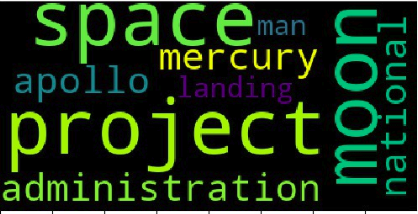

## Summarization of documents with Title of Doc, Summary of Doc and Most frequent word images.
This repository contains the code for summarization of a `Documents` or `Paragraph` with `Title`, `Summary` and `Most frequent word`.
`SODWTSMFW`  --  `Summarization of documents with Title of Doc, Summary of Doc and Most frequent word` 

### Project Structure
```
├── ckpt_	               # Weight used in prediction
├── images               # Most frequent images for input data
├── input-data           # Input data for summary.
├── src                  # SRC contain scripts for training and testing
├── vocab                # Vocab used for summarization.
├── Readme               # Readme for SODWTSMFW
├── requiremnts          # Requirements file for SODWTSMFW
```
#### Input :
[input1.txt](input-data)

#### Result :
##### Title
Project Apollo was the third United States human spaceflight program.
##### Summary
The Apollo program, also known as Project Apollo, was the third United States human spaceflight program carried out by the National Aeronautics and Space Administration (NASA), which accomplished landing the first humans on the Moon from 1969 to 1972. Eisenhower's administration as a three-man spacecraft to follow the one-man Project Mercury which put the first Americans in space, Apollo was later dedicated to President John F. Project Mercury was followed by the two-man Project Gemini (1962–66).
##### Most Frequent Word


#### Input :
[input2.txt](input-data)
#### Result :
##### Title
The Panthers finished the regular season with a 15 minute 1 record.
##### Summary
The Broncos finished the regular season with a 12–4 record, and denied the New England Patriots a chance to defend their title from Super Bowl XLIX by defeating them 20–18 in the AFC Championship Game. They defeated the Arizona Cardinals 49–15 in the NFC Championship Game and advanced to their second Super Bowl appearance since the franchise was founded in 1995. They joined the Patriots, Dallas Cowboys, and Pittsburgh Steelers as one of four teams that have made eight appearances in the Super Bowl.
##### Most Frequent Word


### Research Paper Reference for this repository:

1. [Get To The Point: Summarization with Pointer-Generator Networks](https://arxiv.org/abs/1704.04368)

### Weights for this repository:

[Pretrained weights TF]((https://drive.google.com/file/d/0B7pQmm-OfDv7ZUhHZm9ZWEZidDg/view?usp=sharing))

### Datasets for this repository:

TO get dataset go to links [Download](https://github.com/abisee/cnn-dailymail).

### Model Descriptions:
We have used the concept of `Get to point: Summarization with Pointer-Generator Networks` with `Non-Matrix-Factorization` techniques.

`LSTM : Long Short Term Memory`

Sequence-to-sequence attentional model in two orthogonal ways.

1. First, we use a hybrid pointer-generator network that can copy words from the source text via pointing, which aids accurate reproduction of information, while retaining the ability to produce novel words through the generator.

2. Second, we use coverage to keep track of what has been summarized, which discourages repetition.

#### Run Scripts
`python app1.py`

#### Reference for this repository:

1. [Get To The Point: Summarization with Pointer-Generator Networks](https://arxiv.org/abs/1704.04368)
2. [TextSum code](https://github.com/tensorflow/models/tree/master/textsum)
3. [Datasets](https://github.com/abisee/cnn-dailymail)
4. [Standford-Core-NLP](https://stanfordnlp.github.io/CoreNLP/download.html)
5. [pointer-generator](https://github.com/abisee/pointer-generator)


